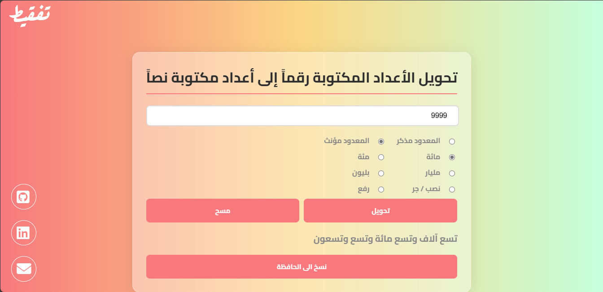

# Tafqit App

Tafqit App is a simple web application that allows users to convert numbers to their textual representation in Arabic. The app uses the [tafqit](https://github.com/SereenALHajjar/tafqit) package as the core conversion engine.

## Features

- Convert numbers to text in Arabic.
- Responsive user interface.
- Supports large and small screen devices.

## Live Demo

You can access the deployed version of the app here: [Tafqit App](https://tafqitapp-production.up.railway.app/static/)

## Installation

To run the application locally:

1. Clone this repository:

    ```bash
    git clone https://github.com/SereenALHajjar/tafqit_app.git
    ```

2. Navigate to the project directory:

    ```bash
    cd tafqit_app
    ```

3. Install dependencies:

    ```bash
    go get ./...
    ```

4. Run the app:

    ```bash
    go run server.go
    ```

## Usage

- Open your browser and navigate to `http://localhost:8009`.
- Input a number, and the app will convert it into Arabic text.

## Screenshots


## Contributing

Contributions are welcome! Please fork this repository and submit a pull request for review.

